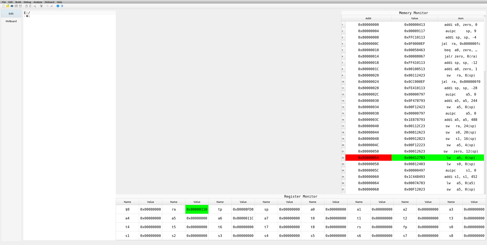

# YSYX_NPC_IDE

## Overview

The ultimate goal of this IDE is to provide a visualization platform for CPU design, code debugging, and validation of peripheral circuits. Firstly, design the CPU using the visualization CPU design tool provided by the IDE (architecture visualization, underlying code needs to be implemented through Verilog). After completing the CPU design, debugging tools in the IDE can be used for debugging. The main method is to compile and load code written in C language onto the designed CPU for testing, verifying whether the basic functions of the CPU are normal. After verification, the IDE can also generate a module from the designed CPU, which facilitates the subsequent construction of peripheral circuits for testing. However, due to limited time and capability, only CPU design code written in Verilog has been debugged so far.

## Table of Contents

[TOC]

## Features

List the main features of the IDE:

- Integrated debugger.

## Installation

### Prerequisites

- **Required software**<p id="prerequisites"></p>

  * Qt

    1. Install Qt5 components

       ```bash
       sudo apt-get install build-essential
       ```

    2. Install Qt development tools

       ```bash
       sudo apt-get install qtbase5-dev qtchooser qt5-qmake qtbase5-dev-tools
       ```

    3. Install qtcreator (non essential)

       ```bash
       sudo apt-get install qtcreator
       ```

    4. Install Qt

       ```bash
       sudo apt-get install qt5*
       ```

  * Verilator

    ```bash
    sudo apt-get install verilator
    ```

    Other versions can be found on the Veriltor official website

  * riscv64-linux-gnu-gcc

    ```bash
    sudo apt install gcc-riscv64-linux-gnu
    ```

  * Cmake

    ```bash
    sudo apt-get install cmake
    ```

### Installing from Source

1. Clone the repository:

   ```bash
   git@github.com:1932287243/NPC_IDE.git
   ```

2. Navigate to the project directory:

   ```bash
   cd IDE
   ```

3. <a href="#prerequisites">Install dependencies</a>

4. Build the project:

   ```bash
   mkdir bin
   mkdir build
   cd build
   cmake ..
   make
   ```

## Usage

``` bash
cd bin
./IDE -l your_logfile.txt --d your_NEMU_REF_SO -f your_elf_file_elf
```

## Screenshots




