# YSYX_IDE

## 1 概述

​	该IDE是一个集成开发和调试平台，专为嵌入式系统和硬件设计提供强大的支持。当前功能包括代码编辑、指令单步调试、源码单步调试、指令内存追踪、寄存器监视以及内存查看等，能够精确控制和分析程序执行，帮助开发人员快速定位问题。同时，IDE还支持NPC设计调试与仿真，能够结合NEMU进行差分测试，定位错误指令的实现，并提供对定时器、串口、VGA等外设的集成仿真，进一步增强系统验证能力。在未来的规划中，IDE将进一步解耦与NPC和NEMU的紧密结合，提升其通用性与灵活性，并实现源码编译、仿真调试与自定义外设测试的无缝集成。此外，IDE还将支持根据设计的电路进行布局（Layout），提供完整的硬件开发生命周期支持，从仿真到物理设计，全面优化芯片开发与验证的效率。

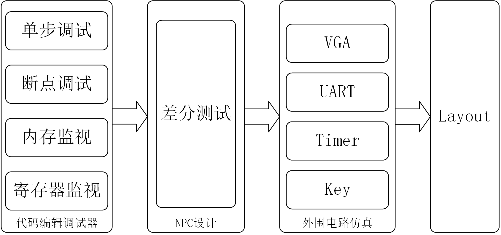

## 2 功能简介

### 2.1 代码编辑/调试（基于NEMU）

#### 2.1.1 概述

​	该功能是基于“一生一芯”项目的NEMU模拟器，旨在为开发人员提供一个集成的开发与调试平台。通过NEMU作为核心，该IDE支持代码编辑与调试功能，包括指令级单步执行、源码级单步执行、内存与寄存器追踪、以及动态内存查看等。开发人员可以在可视化模拟环境中精确控制程序的执行，全面监控程序的内存访问和寄存器状态，实时分析指令执行流。

#### 2.1.2 UI框架

##### （1）整体框架

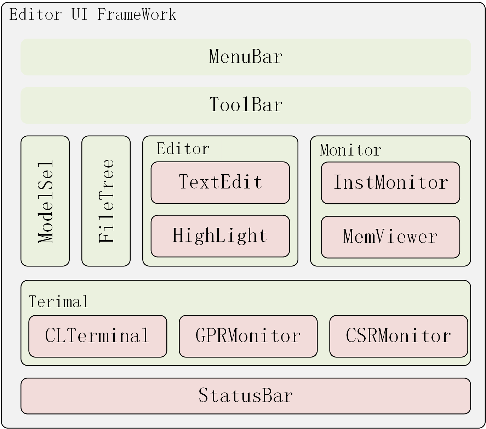

##### （2）编辑调试页面

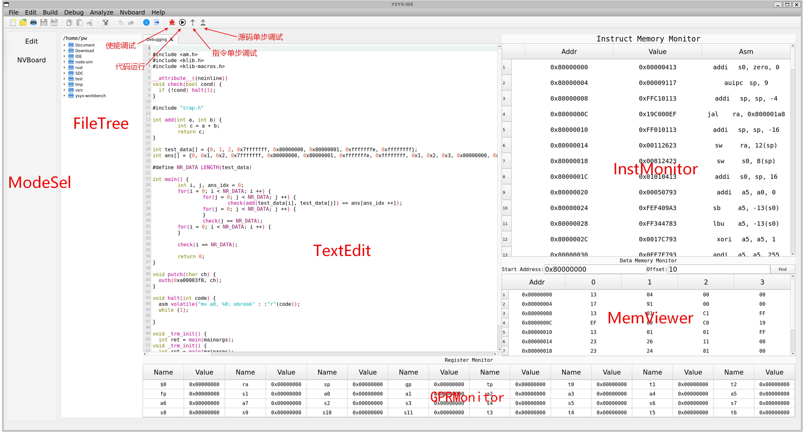

##### （3）外设页面

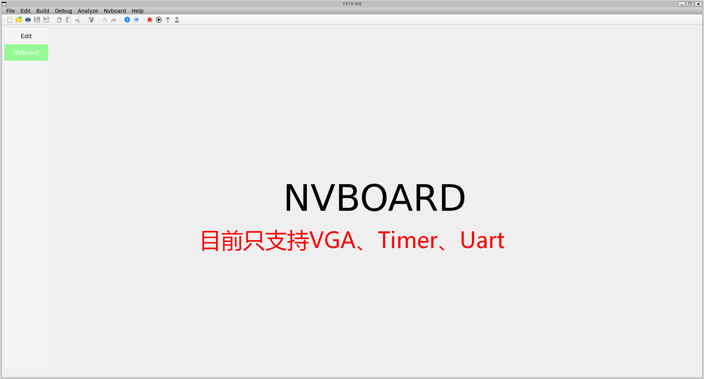

#### 2.1.3 功能介绍与使用

##### （1）模式选择

​	支持多种调试模式的切换，以适应不同的开发和调试需求。

* 批次处理模式（Batch Mode）允许开发人员以自动化方式执行多个测试案例或仿真任务，适用于大规模验证和回归测试，能够快速评估系统的稳定性和性能。

  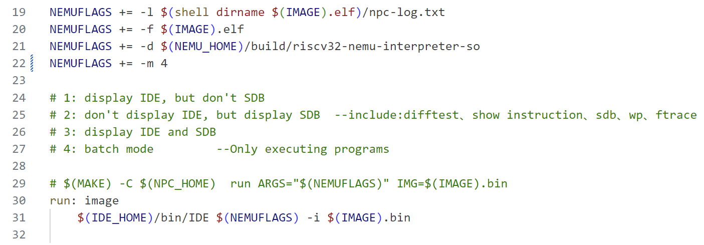

* SDB调试模式（SDB Debugging Mode）基于标准调试协议，提供了与外部调试工具（如GDB）兼容的调试接口，使开发者能够在远程或嵌入式设备上进行精确的指令级调试。

  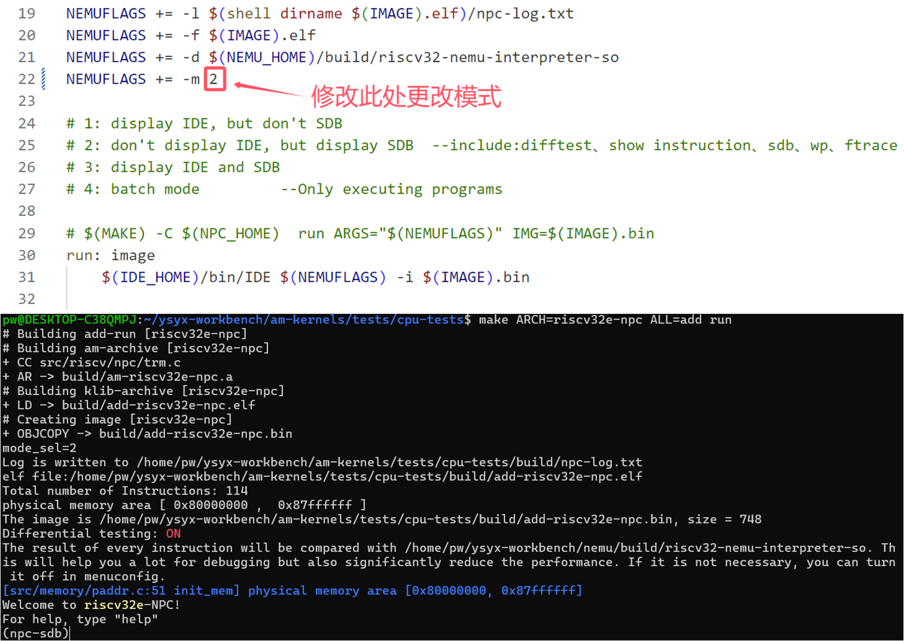

* IDE调试模式（IDE Debugging Mode）则为用户提供全面的图形化调试界面，支持指令单步执行、源码追踪、寄存器和内存监控等功能，增强了开发人员对程序执行过程的可视化和互动控制。通过这些模式的切换，用户可以灵活地在不同的调试环境中工作，满足从开发、调试到验证的多样化需求。

  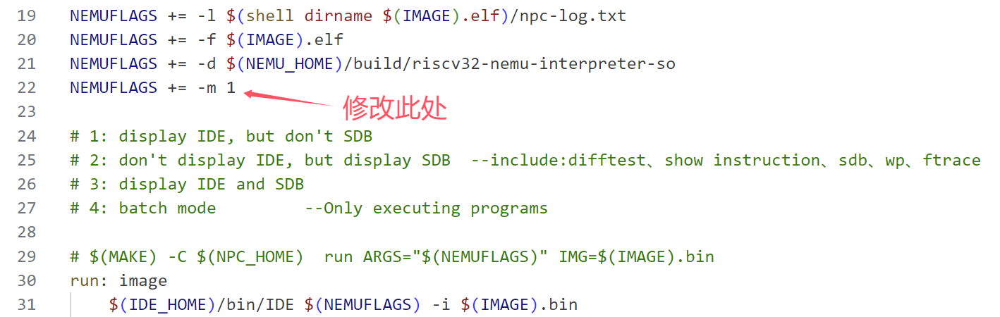

##### （2）单步调试

​	在调试过程中提供了灵活的指令级单步执行功能。在SDB调试模式下，开发人员可以选择逐条执行指令，精准控制程序执行的每一步，或者选择直接运行到程序结束，用于高效地验证程序的执行流程和结果。与之不同，在IDE调试模式中，开发人员可以通过图形化界面上的按钮触发指令单步执行或代码运行，操作更加直观。在指令单步调试时，IDE不仅提供指令级执行控制，还能够实时同步显示源码，确保开发人员能够准确跟踪每个汇编指令与源代码行之间的对应关系。这种同步功能使得调试过程中的代码行为和指令执行紧密结合，有助于深入分析程序逻辑和查找潜在错误。

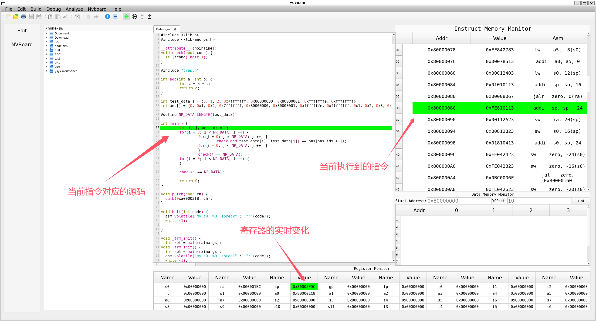

##### （3）查看内存

​	内存查看功能支持在不同调试模式下进行灵活的内存访问。在SDB调试模式下，开发人员可以通过调试指令直接访问和查看内存内容，这种方式适用于低级别调试和远程调试场景，允许开发者精准地指定内存地址进行查看，分析内存中的数据结构和执行状态。而在IDE调试模式中，内存查看功能通过集成的内存查看器提供更加直观和交互式的体验，开发人员可以实时浏览内存中的具体内容。内存查看器支持地址偏移、动态更新，帮助开发人员快速定位内存泄漏、越界访问等问题，提升调试效率和准确性。

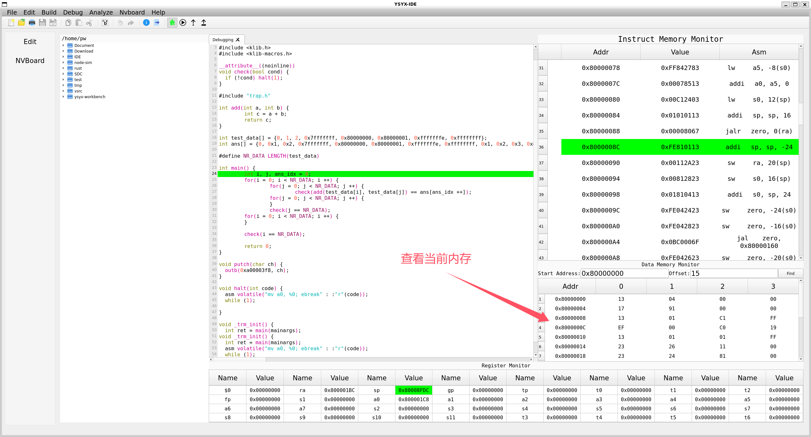

##### （4）指令内存监视

​	指令内存追踪功能，可以精确记录和追踪程序执行的每一条指令及其对应的内存操作。通过对指令执行流的细致追踪，IDE能够实时显示当前执行到的指令地址和内存访问情况，帮助开发人员深入分析程序的执行过程。在差分测试阶段，指令内存追踪能够提供详细的执行路径信息，便于定位潜在的错误或异常行为。这种指令级的追踪能力对于提高调试精度、确保系统稳定性和进行性能分析至关重要，有助于开发人员快速识别和修复问题。

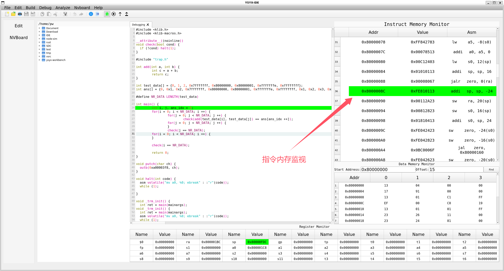

##### （5）寄存器监视

​	寄存器监视功能，能够实时追踪和显示寄存器中的数据变化。通过精确监控寄存器的值，开发人员可以直观地了解每个时钟周期内寄存器状态的变动，特别是在指令执行、数据传输和控制信号变化时。寄存器监视不仅支持单个寄存器的跟踪，还能够显示寄存器组或特定功能寄存器（如程序计数器、标志寄存器等）的状态，帮助开发人员分析指令执行对寄存器值的影响。在调试过程中，寄存器监视功能可用于定位数据传递错误、控制逻辑异常以及执行流问题，确保开发人员对硬件状态的全面理解，进而提升系统的稳定性和可靠性。

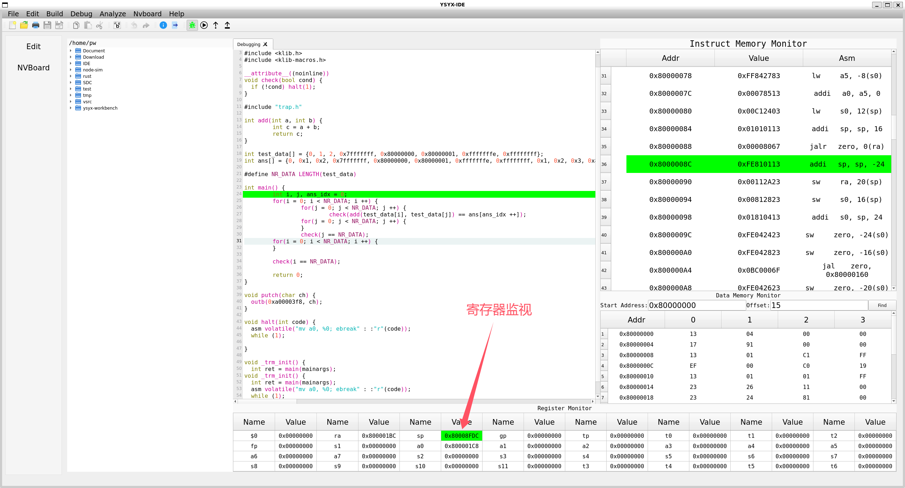

##### （6）支持断点

​	支持断点功能，允许开发人员在调试过程中设置特定的程序执行中断点。当程序执行到设定的断点位置时，IDE会自动暂停程序的执行，等待用户的进一步操作。这种机制使得开发人员能够精确控制程序的执行流，进行细粒度的分析与调试。通过暂停功能，用户可以检查当前程序状态、查看寄存器和内存的内容，或者执行单步调试等操作，以便深入分析程序行为并及时定位潜在问题。断点功能对于精确控制程序执行和分析复杂的逻辑路径具有重要意义，尤其是在处理调试复杂算法、系统交互或硬件仿真时。

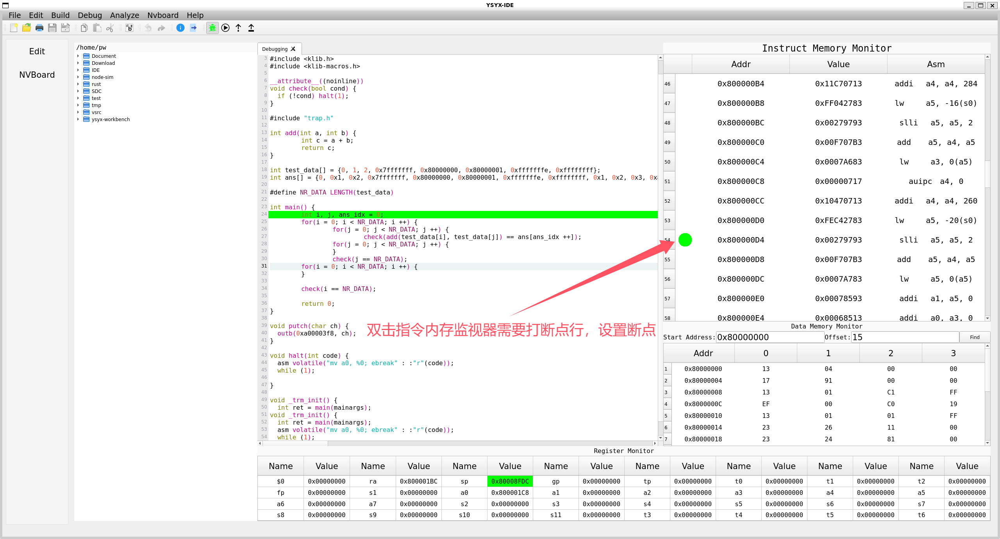

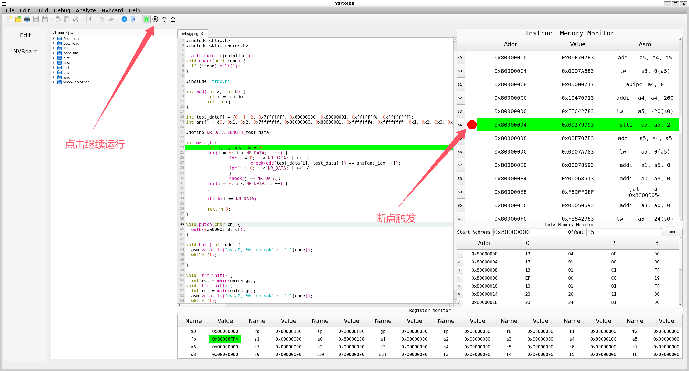

### 2.2 NPC设计/调试/仿真（基于NPC）

#### 2.2.1 概述

​	该IDE不仅支持传统的代码编辑和调试功能，还扩展了对NPC设计的调试与仿真支持。在NPC调试过程中，IDE能够结合NEMU模拟器进行差分测试，通过对比NPC设计与预期行为的执行差异，快速定位错误指令的实现。在差分测试中，IDE会自动跟踪和记录NPC设计中每条指令的执行路径，并与NEMU模拟器的输出进行对比，准确发现执行过程中不一致的地方。此功能使得开发人员能够高效地识别设计中的逻辑错误、指令不匹配或资源冲突，并提供详细的调试信息，有助于加速NPC设计的验证与修正。通过这些功能，IDE为NPC设计提供了一个全面的调试环境，提升了设计验证的精度和效率。

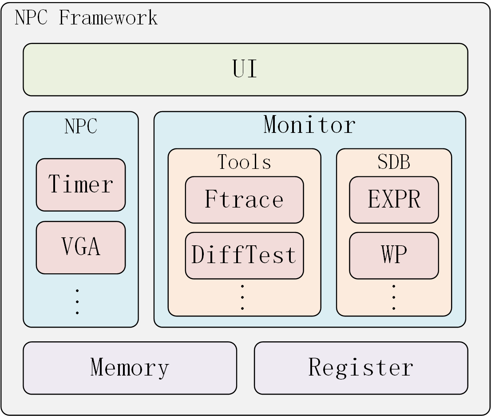

#### 2.2.2 功能介绍与使用

##### （1）NPC调试

​	在NPC调试过程中，IDE能够结合NEMU模拟器进行差分测试，通过对比NPC设计与预期行为的执行差异，快速定位错误指令的实现。在差分测试中，IDE会自动跟踪和记录NPC设计中每条指令的执行路径，并与NEMU模拟器的输出进行对比，准确发现执行过程中不一致的地方。此功能使得开发人员能够高效地识别设计中的逻辑错误、指令不匹配或资源冲突，并提供详细的调试信息，有助于加速NPC设计的验证与修正。

##### （2）外设支持

​	NPC设计调试仿真功能扩展了对外设的支持，使开发人员能够在芯片设计中集成并测试各种外设。目前，IDE支持定时器、串口输出和VGA等常见外设功能，其中VGA的输出可通过集成的NVBoard显示进行实时可视化。通过这种方式，开发人员可以直观地查看和验证芯片与外设之间的交互。未来，IDE将进一步优化界面，以支持用户自定义外围电路的设计与仿真测试。通过这一功能，开发人员能够在调试阶段灵活地测试和验证自定义外设与芯片设计的兼容性，确保系统的功能和性能满足设计要求。该功能显著提升了系统集成和验证的效率。

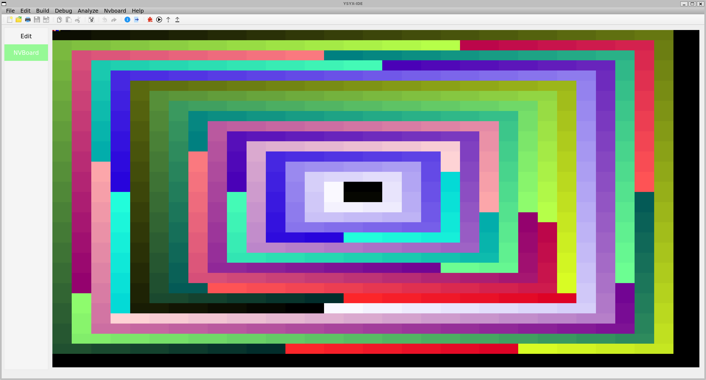

## 3 环境搭建与编译使用

### 3.1 环境搭建

#### （1） 安装cmake

```bash
sudo apt-get install cmake
```

#### （2） 安装RISCV编译器

```bash
sudo apt install gcc-riscv64-linux-gnu
sudo apt install g++-riscv64-linux-gnu
```

#### （3） 安装LLVM

> :heavy_exclamation_mark:注意`Ubuntu22.04`只支持`llvm-13`及以下，`Ubuntu24.04`不受此限制。
>
> 如果不是安装的`llvm-13`版本，需要修改`${InstallationPath}/IDE/src/vsec/CMakeLists.txt`
>
> 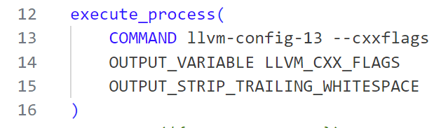
>
> 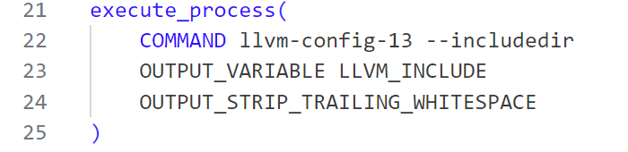

```bash
sudo apt-get install llvm-13 llvm-13-dev
```

#### （4） Verilator

* 命令行安装

  ```bash
  sudo apt-get install verilator
  ```

* 源码安装(本项目使用的版本是v5.008)

  ```bash
  # Prerequisites:
  #sudo apt-get install git help2man perl python3 make autoconf g++ flex bison ccache
  #sudo apt-get install libgoogle-perftools-dev numactl perl-doc
  #sudo apt-get install libfl2  # Ubuntu only (ignore if gives error)
  #sudo apt-get install libfl-dev  # Ubuntu only (ignore if gives error)
  #sudo apt-get install zlibc zlib1g zlib1g-dev  # Ubuntu only (ignore if gives error)
  
  git clone https://github.com/verilator/verilator   # Only first time
  
  # Every time you need to build:
  unsetenv VERILATOR_ROOT  # For csh; ignore error if on bash
  unset VERILATOR_ROOT  # For bash
  cd verilator
  git pull         # Make sure git repository is up-to-date
  git tag          # See what versions exist
  #git checkout master      # Use development branch (e.g. recent bug fixes)
  #git checkout stable      # Use most recent stable release
  #git checkout v{version}  # Switch to specified release version
  
  autoconf         # Create ./configure script
  ./configure      # Configure and create Makefile
  make -j `nproc`  # Build Verilator itself (if error, try just 'make')
  sudo make install
  ```

#### （5） 安装Qt

```bash
sudo apt-get install build-essential
sudo apt-get install qtbase5-dev qtchooser qt5-qmake qtbase5-dev-tools
sudo apt-get install qt5*
```

#### （6） 其他依赖库

```bash
sudo apt-get install libreadline-dev    # a library used later
sudo apt-get install ccache
```

### 3.2 项目编译

#### （1）克隆仓库

```bash
git@github.com:1932287243/NPC_IDE.git
```

#### （2）导航到项目目录

```bash
cd ${InstallationPath}/IDE
```

#### （3）编译项目

```bash
mkdir bin build
pushd build
cmake ..
make
popd
```

### 3.3 项目运行

#### （1）导出环境变量

> 可以追加在`~/.bashrc`文件最后，以便每次启动终端可以直接导出环境变量

```bash
export IDE_HOME=${YSYX Installation Path}/ysyx-workbench/IDE
```

#### （2）修改相关文件

> :exclamation: 由于目前只支持调试NPC,暂不支持NEMU调试。且NPC代码和IDE未实现解耦。还需修改如下：

* 修改“一生一芯”项目中`Abstract Mochine`目录中`${YSYX Installation Path}/ysyx-workbench/abstract-machine/scrips/platform/npc.mk`文件使其在`am-kernels`文件下编译运行测试代码时，能够直接启动IDE进行调试。

  ```makefile
  NEMUFLAGS += -l $(shell dirname $(IMAGE).elf)/npc-log.txt
  NEMUFLAGS += -f $(IMAGE).elf 
  NEMUFLAGS += -d $(NEMU_HOME)/build/riscv32-nemu-interpreter-so 
  NEMUFLAGS += -m 1
  
  # 1: display IDE, but don't SDB
  # 2: don't display IDE, but display SDB  --include:difftest、show instruction、sdb、wp、ftrace
  # 3: display IDE and SDB
  # 4: batch mode         --Only executing programs
  
  # $(MAKE) -C $(NPC_HOME)  run ARGS="$(NEMUFLAGS)" IMG=$(IMAGE).bin
  run: image
  	$(IDE_HOME)/bin/IDE $(NEMUFLAGS) -i $(IMAGE).bin
  
  image: $(IMAGE).elf
  	@$(OBJDUMP) -d $(IMAGE).elf > $(IMAGE).txt
  	@echo + OBJCOPY "->" $(IMAGE_REL).bin
  	@$(OBJCOPY) -S --set-section-flags .bss=alloc,contents -O binary $(IMAGE).elf $(IMAGE).bin
  ```

* 若想调试自己的NPC代码（否则不作任何修改），只需要将自己NPC代码拷贝到`${IDE Installation Path}/src/vsrc`目录下，拷贝前需要提前删除该目录下所有的verilog代码文件。在代码拷贝完成之后，还需要修改顶层文件的模块名，以及通过寄存器模块名来满足IDE（目前还仅限于自己代码测试，未解耦，故需要如此），需要修改的文件如下

  * 顶层模块

    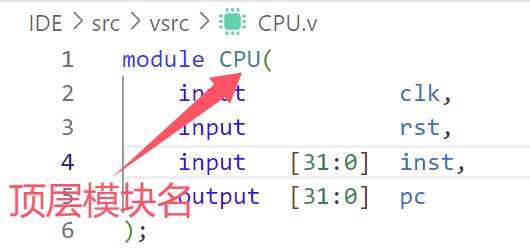

  * 寄存器模块

    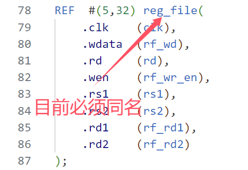

  * pc名

    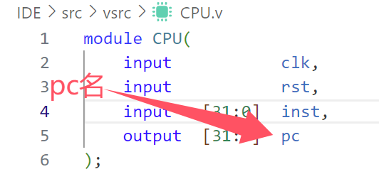

  * 其他

    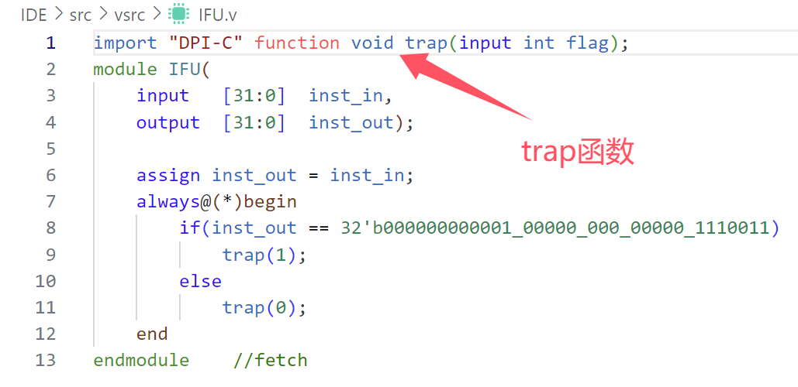

    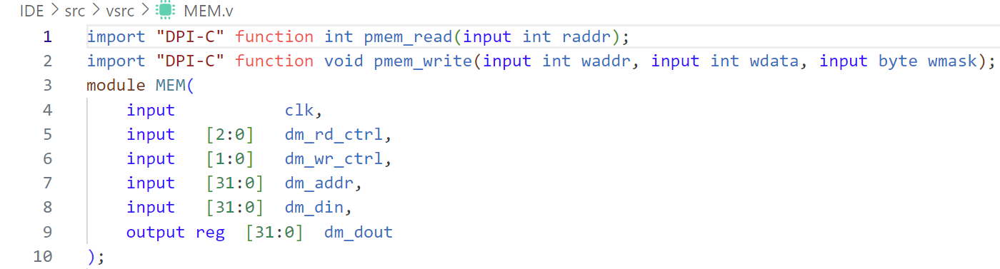

* 修改完需要重新编译（未修改则不需要）

#### （3）运行

* 模式一：批处理模式

  修改`npc.mk`文件即可（详细过程见第二章）

* 模式二：SDB调试模式详细

  修改`npc.mk`文件即可（详细过程见第二章）

* 模式三：IDE调试模式

  修改`npc.mk`文件即可（详细过程见第二章）

## 4 未来规划

### 4.1 IDE解耦

在未来的版本规划中，该IDE将进行重要的架构优化，目标是将IDE与当前实现的NPC和NEMU解耦。这一改进将使得IDE在仿真与调试过程中更加灵活和模块化，便于用户将自定义设计的芯片与IDE无缝集成进行仿真与调试。通过解耦，IDE将能够独立于具体的NPC实现，支持更广泛的硬件设计和仿真需求，提升其适应性和可扩展性。此举不仅简化了对不同芯片设计的仿真流程，还使得开发人员能够更加便捷地测试和调试不同硬件架构与外设的组合，进一步增强系统验证与调试的效率。

### 4.2 IDE实现C/C++源码编译

未来将实现源码编译与测试的集成，开发人员将能够直接在IDE内部进行源码的编译和仿真调试，无需再切换到`am-kernel`目录下执行独立的命令进行操作。这一功能的实现将大大简化开发流程，提高开发效率，使得调试和验证过程更加高效和流畅。此外，该改进为后续实现自定义代码测试奠定基础，开发人员可以在IDE中直接编写、编译、运行和调试自定义代码，支持快速迭代和实时调试，进一步提升系统开发的灵活性与便捷性。

### 4.3 实现代码跳转（目前还没有思路）

在未来的规划中，该IDE将增强单步调试功能，使得当程序执行跨越多个源文件时，调试器能够智能地跳转到对应文件和行号的源码位置。这一功能的实现将提升代码调试的可操作性与直观性，特别是在涉及多文件、模块化或库依赖的复杂项目中。通过自动跳转到相关的源代码位置，开发人员能够更高效地理解和分析代码的执行流程，减少手动查找代码文件和行号的时间，从而加速调试和错误定位的过程。

### 4.4 搭建外围仿真电路(基于QNodes)

在未来的规划中，该IDE将支持基于用户自定义设计的芯片，搭建并仿真测试外围电路。这一功能将为硬件设计者提供一个完整的开发和验证环境，用户可以在虚拟仿真平台中集成并验证各种外围电路（如传感器、外设接口等），确保芯片与外围系统的兼容性与稳定性。通过这种集成仿真，开发人员能够在芯片设计阶段提前发现潜在的硬件交互问题，优化电路设计，提升系统的整体性能和可靠性。该功能将极大增强IDE在硬件设计与验证中的作用，提供更加灵活和高效的开发流程。

### 4.5 根据仿真电路进行Layout（目前没想好怎么做）

未来将扩展支持根据前面设计的仿真电路进行布局（Layout）。这一功能将使得开发人员能够在芯片设计的后期阶段，根据电路仿真结果，生成精确的物理布局。通过集成布局工具，IDE能够根据电路图、元件规格和信号连接自动或手动布置芯片内部的各个模块和线路，并生成布局文件。

## 5 开源仓库位置

```bash
git@github.com:1932287243/NPC_IDE.git
```


